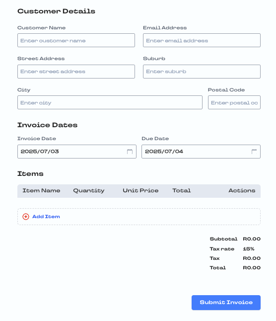
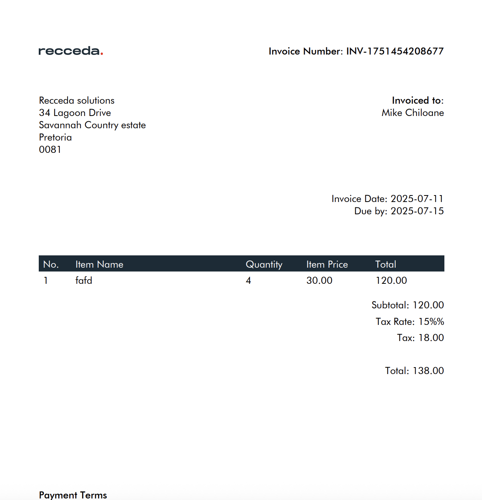

# Invoice Generator Frontend

A modern, responsive Next.js web application for generating professional invoices with a clean, user-friendly interface.

## About This Project

The Invoice Generator is built with Next.js and TypeScript, designed to create professional invoices with ease. It leverages the powerful features of Next.js including server-side rendering and optimized client-side navigation to provide a fast, responsive interface that adapts to both desktop and mobile devices.

## Screenshots





## Core Functionality

- Create and customize invoices with client and business details
- Add, edit, and remove line items from invoices
- Set invoice dates and due dates using a custom calendar picker
- Calculate subtotals, apply tax rates, and generate final amounts automatically
- Validate form inputs to ensure data integrity

## Technical Implementation

The application leverages several modern web technologies:

- **Next.js Framework**: Built on React with enhanced features for performance and SEO
- **State Management**: Uses Zustand for centralized state management, making it easy to track and update invoice data across components
- **Form Components**: Custom input components handle different data types (text, numbers, dates)
- **Responsive Design**: Different components render based on screen size (ItemsTable for desktop, MobileItemCard for mobile)
- **Data Validation**: Form validation ensures all required fields are completed correctly

## Key Features

### Invoice Items Management

Users can add items with names, quantities, and prices. The system automatically calculates the total for each item and updates the invoice subtotal accordingly.

### Date Selection

The application includes a custom date picker that displays dates in a user-friendly format (e.g., "25 June 2025") while maintaining proper date values for calculations and export.

### Real-time Calculations

As users add or remove items and adjust tax rates, the application immediately updates all calculations, showing accurate subtotals, tax amounts, and final totals.

### Form Validation

The system validates all inputs, ensuring that item names are provided, quantities and prices are positive numbers, and all required information is included before finalizing the invoice.
│   │   └── FormContext.tsx
│   └── page.tsx
├── public/
│   ├── add.svg
│   └── delete.svg
├── README.md
└── package.json
```

## Key Components

### Form Context

The `FormContext.tsx` provides a central state management solution using Zustand. It manages:

- Invoice details (dates, customer information)
- Line items (products/services, quantities, prices)
- Calculations (subtotals, tax rates, final amounts)

### Input Components

- **TextInput**: Flexible text input component with support for:
  - Regular text fields
  - Number inputs
  - Custom date picker with formatted date display
  - Validation error messages

### Item Section Components

- **ItemsTable**: Desktop view for displaying and managing invoice items
- **MobileItemCard**: Mobile-optimized view for displaying invoice items
- **AddItemMobile**: Component for adding new items to the invoice

## Usage

### Adding Items

1. Click the "Add Item" button
2. Fill in the item name, quantity, and price
3. Click "Add Item" to add it to the invoice
4. The subtotal, tax, and total will automatically update

### Setting Dates

1. Click on date fields to open the calendar picker
2. Select a date from the calendar
3. The date will be displayed in the format "25 June 2025"

### Validation

The form validates user input to ensure:
- Item names are provided
- Quantities are greater than zero
- Prices are valid numbers

## Development

### Prerequisites

- Node.js (v14 or later)
- npm or yarn

### Installation

```bash
# Clone the repository
git clone <repository-url>

# Navigate to the project directory
cd invoice-generator-fe

# Install dependencies
npm install
# or
yarn install

# Set up environment variables
cp .env.example .env.local
# Edit .env.local with your API URL
```

### Environment Variables

Copy `.env.example` to `.env.local` and configure the following:

- `NEXT_PUBLIC_INVOICE_API_URL`: Your invoice generation API endpoint

### Running the Development Server

```bash
# Start the development server
npm run dev
# or
yarn dev
```

Then open [http://localhost:3000](http://localhost:3000) in your browser.

### Building for Production

```bash
# Create production build
npm run build

# Start production server
npm run start
```

## License

[MIT License](LICENSE)
